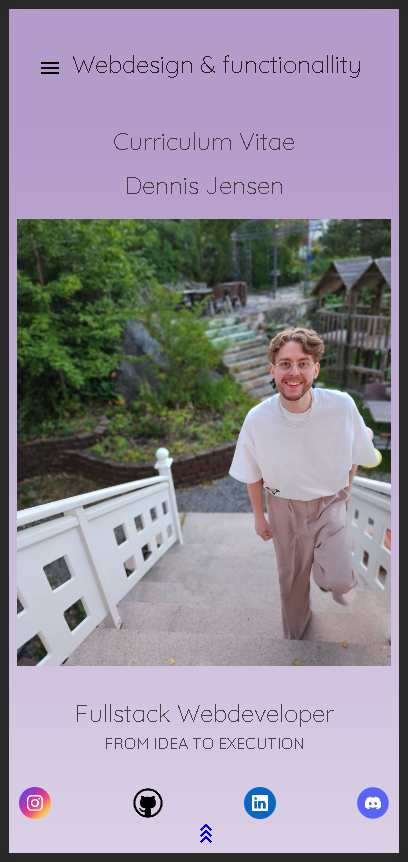

# Static Website - CV Presentation

## Description

This project represents my CV through a responsive static webpage. It is my first project at Chas Academy, where I used HTML and CSS to create a one-page site.

## Features

- Responsive design for both mobile and desktop screens (tested on an iPhone 12 Pro).
- Mobile-friendly navigation with links to different sections of the page.
- Gradient in CSS for design variation.
- Embedded video (for example, from YouTube).
- At least one image to enhance visual appeal.
- At least one table to present information in a structured manner.

## Technologies

- HTML
- CSS

## Installation

1. Clone the project from the GitHub repository: [u01 Static Website - HTML & CSS](https://github.com/LloydElery/u01-Static-Website-HTML-CSS)
2. Open the HTML file in your browser.

## Usage (Not applicable)

Navigate through the page to get to know me through my CV and find information about my skills and experiences.

## Demo

## Contribute

If you want to contribute to improvements or corrections, create a fork and submit a pull request.

## Contact

- [LinkedIn](https://www.linkedin.com/in/dennis-jensen-stockholm/)
- [Email](lloydelery@gmail.com)

## Acknowledgements

I would like to thank Chas Academy for giving me the opportunity to create this project and providing me with the necessary knowledge.

## Additional Information

This assignment is part of Chas Academy's Web Development Bootcamp. The project is assessed based on the following objectives:

- HC 2.1 Develop responsive and browser-adapted web pages with HTML and CSS according to current web standards.
- HC 2.3 Optimize and validate HTML & CSS.
- HC 2.4 Develop web pages with accessibility in mind.
- HC 3.1 Work as a Fullstack web developer with HTML & CSS.
- UD 2.1 Create basic graphics and design for the web.
- UD 2.2 Apply guidelines within usability.
- PG 2.9 Work with version control both individually and within a team.
